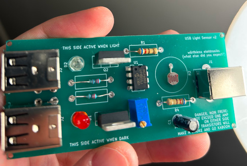
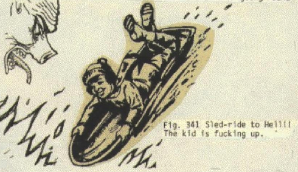
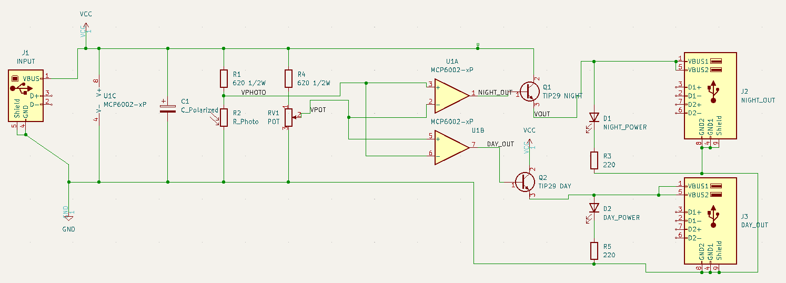

# Auto-switching USB dark sensor for USB light strips, etc.

I have a couple of LED light strip controllers that lacked an important function: they didn't turn on when it was dark out. This board remedies that issue.
It amazes me how nobody thought to build a product like this before. Or such a product does exist but I didn't find it online.

This circuit is entirely analog so no source code is provided. You get the Gerbers instead.

# Bill of Materials

* USB-B connector for power lead in
* 2x 620 ohm resistors
* MCP6002 or similar op-amp
* 2x TIP29 transistors (any B/C/E transistor able to handle the voltage/current requirements here works)
* Photoresistor (15k-30k works)
* Potentiometer across RV1 for fine-tuning
* Twin USB-A connectors for the output
* 5mm LEDs and 220 ohm resistors to indicate status, as appropriate
* 6.3v 47uF courtesy cap

# Schematic

Seriously, though, this is a really simple op-amp circuit that is readily available online. I just wanted a PCB for it because it was cleaner.

# How it works

Fairly typical voltage divider across the resistor and photoresistor. Op-amp acts as comparator and switches the transistors accordingly.

R1 and the phototransistor form a voltage divider, with R1 acting as the current limiting resistor.
When sunlight is shining on the photoresistor, the photoresistor's resistance drops to 0 ohms, pulling
the sunlight signal low. But when it is dark, the photoresistor's resistance increases, pulling it
closer to +5v. This signal is then compared with a reference voltage formed by R2. The op-amp compares
the voltages and switches on the appropriate transistors. God, that's boring. Why would you want to
read all that bullshit.

# Known issues

* Transistors don't turn on fully, so some USB-powered devices (particularly ATTinys) will lock up or not work correctly. Use at your own risk.
* Dark/light circuits can both be on at the same time, which is undesirable.
* TIP29 transistors are inappropriate for 5v usage (it's just what I had lying around).
* Thing is more optimized as a dark sensor than it is a light sensor.
* Calibration is a pain in the ass by nature of this circuit being analog. A digital version is planned in the future.

# License

Public domain

# "But I really want the schematic!!!"

